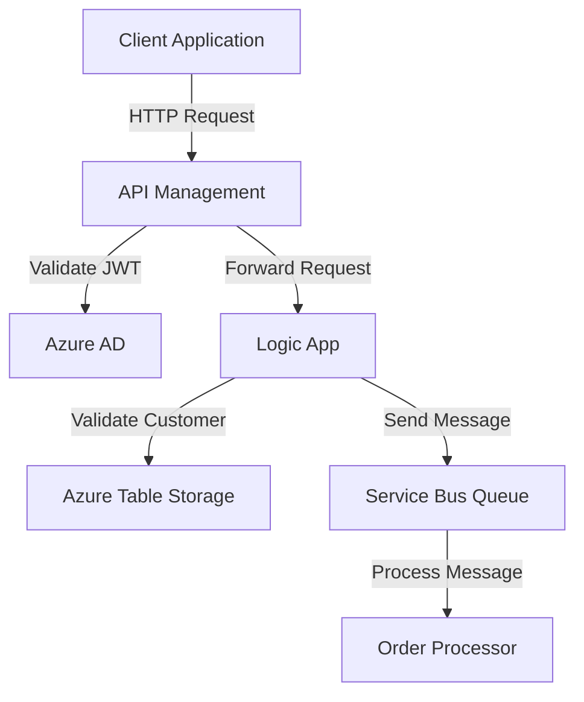

# Azure Integration Changes Documentation

## Executive Summary

This document outlines the recent changes introduced in the Azure integration as part of commit `4a0e113` to the `main` branch. These changes include updates to API Management (APIM) policies, Azure Logic Apps, Service Bus configurations, and supporting infrastructure. The primary objective of these updates is to enhance security, scalability, and maintainability of the integration architecture while ensuring compliance with organizational and regulatory standards.

Key highlights:
- **Enhanced Security**: Implementation of JWT validation, API key fallback, and CORS policies in APIM.
- **Improved Scalability**: Service Bus queue configuration with partitioning and batched operations.
- **Streamlined Logic App Workflow**: Updated triggers and actions to handle complex order processing scenarios.

---

## Technical Summary

### 1. API Management (APIM) Policy Updates
- **File:** `test/apim-policy.xml`
- **Changes:**
  - Added rate-limiting policy to restrict API calls to 100 requests per minute per IP.
  - Configured CORS policy to allow specific origins (`https://app.contoso.com`, `https://portal.contoso.com`).
  - Implemented JWT validation for authentication using Azure AD OpenID Connect.
  - Added fallback authentication using API keys for requests without a valid JWT token.

### 2. Azure Logic App Updates
- **File:** `test/sample.logicapp.json`
- **Changes:**
  - Enhanced trigger schema to validate incoming HTTP requests with required fields (`orderId`, `customerId`, `amount`).
  - Added parameters for secure connections (`serviceBusConnectionString`, `cosmosDbEndpoint`, `storageAccountKey`).
  - Introduced a new action (`Validate_Customer`) to validate customer data using Azure Table Storage.

### 3. Service Bus Queue Configuration
- **File:** `test/servicebus-queue-config.json`
- **Changes:**
  - Configured a new Service Bus queue (`order-processing-queue`) with the following properties:
    - Partitioning enabled for scalability.
    - Dead-lettering on message expiration.
    - Duplicate detection with a 10-minute history window.
    - Monitoring enabled with metrics retention for 30 days.
  - Added a subscription (`order-processor-subscription`) with a SQL filter for high-priority messages.

---

## Integration Impact and Dependencies

### Downstream Effects
- **APIM Policies**: Applications consuming APIs must adhere to the new JWT authentication and rate-limiting policies.
- **Logic Apps**: Downstream systems must ensure that HTTP requests sent to the Logic App comply with the updated schema.
- **Service Bus**: Consumers of the `order-processing-queue` must handle partitioned messages and adhere to the subscription filter criteria.

### Dependencies
- Azure AD for JWT validation.
- Azure Table Storage for customer validation in Logic Apps.
- Azure Monitor for Service Bus diagnostics.

---

## Configuration Requirements

### Environment Variables and Secrets
| Parameter                  | Type          | Description                                |
|----------------------------|---------------|--------------------------------------------|
| `serviceBusConnectionString` | Secure String | Connection string for the Service Bus namespace. |
| `cosmosDbEndpoint`         | String        | Endpoint URL for Cosmos DB.               |
| `storageAccountKey`        | Secure String | Access key for Azure Storage account.     |

### APIM Configuration
- Ensure the OpenID Connect configuration URL is accessible: `https://login.microsoftonline.com/contoso.onmicrosoft.com/v2.0/.well-known/openid-configuration`.

### Service Bus Configuration
- Create the `order-processing-queue` with the specified properties in `test/servicebus-queue-config.json`.

---

## Security Considerations

1. **Authentication and Authorization**:
   - JWT validation ensures only authenticated users with valid roles (`OrderProcessor`, `Administrator`) can access APIs.
   - API key fallback provides additional security for legacy systems.

2. **Data Protection**:
   - Secure parameters (`serviceBusConnectionString`, `storageAccountKey`) are used to prevent sensitive data exposure.
   - Dead-lettering ensures failed messages are retained for troubleshooting.

3. **Compliance**:
   - The changes align with GDPR and ISO 27001 by enforcing secure authentication and data retention policies.

---

## Cost Implications

| Resource                  | Cost Impact                                                                 |
|---------------------------|-----------------------------------------------------------------------------|
| **API Management**        | Increased costs due to additional policies (rate limiting, JWT validation). |
| **Service Bus**           | Higher costs for enabling partitioning and monitoring.                     |
| **Logic Apps**            | Minimal cost increase due to additional actions and triggers.              |

---

## Architecture Diagram

Below is a suggested architecture diagram using Mermaid syntax to visualize the integration flow:

---

## Testing Checklist

1. **API Management**:
   - Verify JWT validation with valid and invalid tokens.
   - Test rate-limiting by sending more than 100 requests per minute.
   - Validate CORS policy with allowed and disallowed origins.

2. **Logic App**:
   - Test HTTP trigger with valid and invalid payloads.
   - Validate customer data retrieval from Azure Table Storage.

3. **Service Bus**:
   - Send messages to the `order-processing-queue` and verify subscription filters.
   - Test dead-lettering by sending expired messages.

---

## Deployment Notes

1. **Pre-Deployment**:
   - Ensure all required Azure resources (APIM, Logic Apps, Service Bus, Azure AD) are provisioned.
   - Update environment variables in Azure Key Vault or configuration files.

2. **Deployment Steps**:
   - Deploy APIM policies using the Azure portal or ARM templates.
   - Deploy Logic App updates using the Azure portal or Bicep/Terraform templates.
   - Configure Service Bus queue and subscriptions using the Azure portal or `test/servicebus-queue-config.json`.

3. **Post-Deployment**:
   - Perform end-to-end testing to validate the integration.
   - Monitor logs and metrics for anomalies.

---

This documentation provides a comprehensive overview of the changes and their implications. For further assistance, contact the Azure Solutions Team.