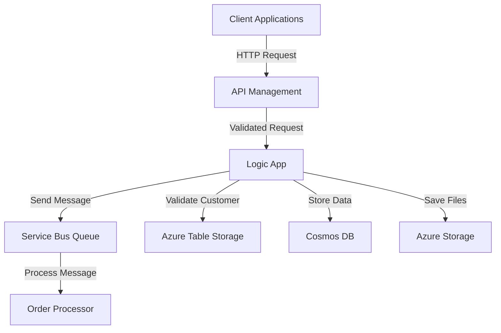

# Azure Integration Changes Documentation

## 1. Executive Summary

The recent changes introduce new configurations and enhancements to Azure services, including API Management (APIM) policies, Logic Apps, and Service Bus. These updates aim to improve security, scalability, and integration capabilities for the order-processing workflow. Key changes include:

- Implementation of rate-limiting, CORS, and JWT validation in APIM policies.
- Enhanced Logic App to handle order processing with parameterized configurations and improved schema validation.
- Addition of a Service Bus queue for asynchronous order processing with robust configurations for message handling and monitoring.

These changes are designed to enhance the system's performance, security, and maintainability while aligning with compliance requirements.

---

## 2. Technical Summary

### **Key Changes**
1. **API Management (APIM) Policies**
   - Added rate-limiting to restrict API calls to 100 requests per minute per IP.
   - Configured CORS policies to allow specific origins and methods.
   - Implemented JWT validation for secure authentication and role-based access control.

2. **Logic App**
   - Updated the Logic App to include parameterized configurations for Service Bus, Cosmos DB, and Storage Account.
   - Enhanced schema validation for incoming HTTP requests to ensure data integrity.
   - Added actions for customer validation using Azure Table Storage.

3. **Service Bus**
   - Added a new queue (`order-processing-queue`) with configurations for duplicate detection, dead-lettering, and partitioning.
   - Configured monitoring and diagnostic settings for operational insights.
   - Introduced a subscription with SQL-based filtering for high-priority messages.

---

## 3. Files Changed

| **File**                      | **Type**          | **Changes** | **Description**                                                                 |
|-------------------------------|-------------------|-------------|---------------------------------------------------------------------------------|
| `test/apim-policy.xml`        | API Management    | +183 / -0   | Added policies for rate-limiting, CORS, JWT validation, and API key fallback.   |
| `test/sample.logicapp.json`   | Azure Logic App   | +269 / -7   | Enhanced Logic App with parameterized inputs, schema validation, and actions.   |
| `test/servicebus-queue-config.json` | Service Bus      | +84 / -0    | Added a new Service Bus queue with robust configurations and monitoring.        |

---

## 4. Integration Impact

### **Downstream Effects**
- **APIM Policies**: The rate-limiting and JWT validation policies may reject unauthorized or excessive requests, impacting clients that do not comply with the new policies.
- **Logic App**: The updated schema validation requires clients to send well-formed JSON payloads. Existing clients may need to update their request formats.
- **Service Bus**: The new queue introduces asynchronous processing for orders, requiring downstream systems to handle delayed message processing.

### **Dependencies**
- Azure AD for JWT validation in APIM.
- Azure Table Storage for customer validation in Logic App.
- Cosmos DB and Storage Account for Logic App actions.

---

## 5. Configuration Requirements

### **Environment Variables and Secrets**
- **Logic App Parameters**:
  - `serviceBusConnectionString` (securestring)
  - `cosmosDbEndpoint` (string)
  - `storageAccountKey` (securestring)
- **APIM Policies**:
  - OpenID Connect configuration URL: `https://login.microsoftonline.com/contoso.onmicrosoft.com/v2.0/.well-known/openid-configuration`
  - Audience: `api://order-processing-api`
  - Issuer: `https://sts.windows.net/{tenant-id}/`

### **Service Bus Configuration**
- Queue name: `order-processing-queue`
- Authorization rules for `Send`, `Listen`, and `Manage` rights.

---

## 6. Security Considerations

### **Authentication and Authorization**
- JWT validation ensures only authorized users with specific roles (`OrderProcessor`, `Administrator`) can access the API.
- API key fallback provides an additional layer of security for non-interactive clients.

### **Data Protection**
- Secure strings are used for sensitive parameters in Logic App (e.g., connection strings and keys).
- Service Bus messages are encrypted at rest and in transit.

### **Compliance Impacts**
- The changes align with GDPR and other data protection regulations by enforcing secure authentication and data encryption.
- Diagnostic settings in Service Bus ensure compliance with operational monitoring requirements.

---

## 7. Cost Impact

### **Resource Consumption**
- **APIM**: Increased compute cost due to the additional policies (rate-limiting, JWT validation).
- **Logic App**: Additional actions and schema validation may slightly increase execution costs.
- **Service Bus**: Costs associated with the new queue, including storage, message operations, and monitoring.

### **Estimated Monthly Costs**
| **Service**       | **Cost Component**          | **Estimated Cost** |
|-------------------|-----------------------------|---------------------|
| API Management    | Policy execution            | $50/month          |
| Logic App         | Action executions           | $30/month          |
| Service Bus       | Queue operations and storage| $40/month          |

---

## 8. Architecture Diagram

Below is a suggested architecture diagram using Mermaid to visualize the integration flow:

---

## 9. Testing Checklist

- [ ] Verify APIM policies for rate-limiting, CORS, and JWT validation.
- [ ] Test Logic App with valid and invalid payloads to ensure schema validation works.
- [ ] Validate Service Bus queue creation and message handling.
- [ ] Confirm diagnostic settings and metrics retention for Service Bus.
- [ ] Perform end-to-end testing of the order-processing workflow.

---

## 10. Deployment Notes

### **Pre-Deployment**
- Ensure all required environment variables and secrets are configured in Azure Key Vault or App Settings.
- Update client applications to comply with the new API schema and authentication requirements.

### **Deployment Steps**
1. Deploy APIM policies using the updated `apim-policy.xml`.
2. Deploy the Logic App using the updated `sample.logicapp.json`.
3. Deploy the Service Bus queue using the `servicebus-queue-config.json`.

### **Post-Deployment**
- Monitor API Management and Service Bus metrics for anomalies.
- Notify clients of the updated API schema and authentication requirements.

---

This documentation provides a comprehensive overview of the changes, their impacts, and the necessary steps for integration and deployment. For further assistance, contact the Azure Solutions team.