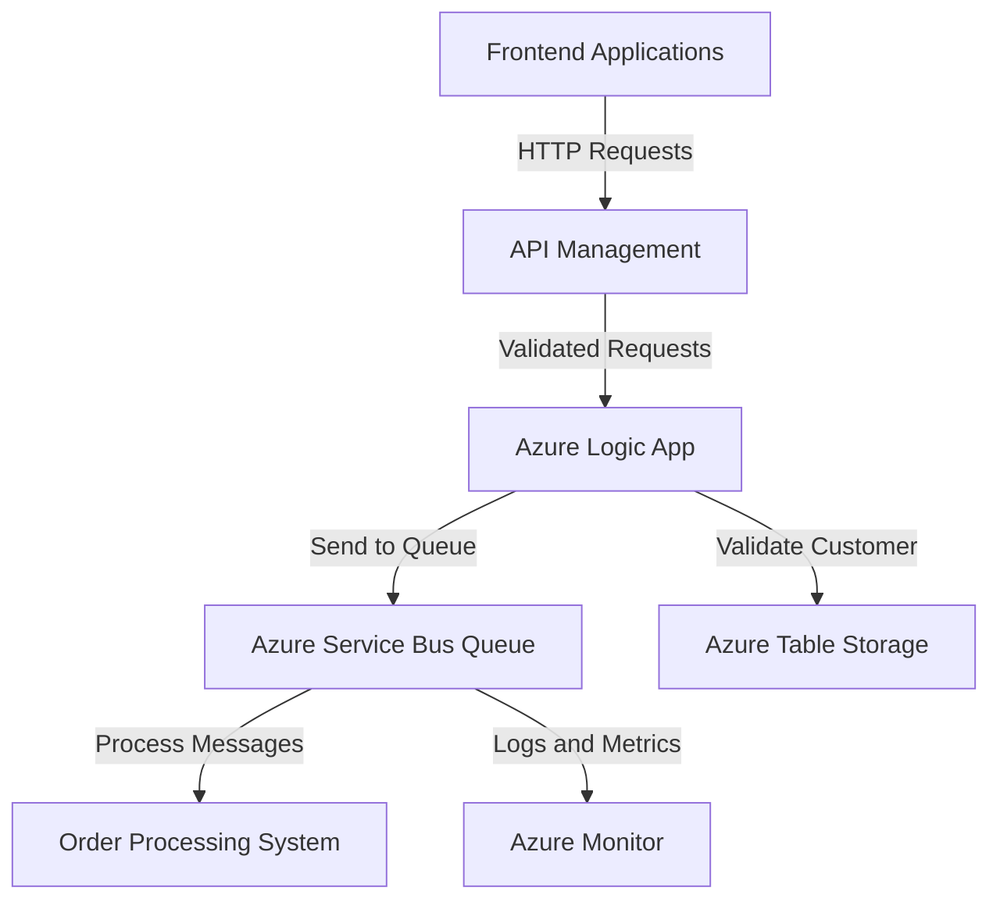

# Azure Integration Changes Documentation

## 1. Executive Summary

This update introduces several enhancements to Azure integrations, focusing on API Management (APIM) policies, Logic Apps, and Service Bus configurations. The changes aim to improve security, scalability, and operational efficiency for the order-processing workflow. Key features include:

- **Enhanced security**: JWT validation, API key fallback, and rate limiting in APIM.
- **Improved data processing**: Updated Logic App schema and actions for order validation.
- **Scalable messaging**: New Service Bus queue configuration with partitioning and dead-lettering.

These changes align with organizational goals to enhance system reliability, secure sensitive data, and streamline order-processing operations.

---

## 2. Technical Summary

### Key Changes
1. **API Management (APIM) Policies**:
   - Added rate limiting to prevent abuse.
   - Implemented CORS policy for frontend integration.
   - Configured JWT validation for secure authentication.
   - Added fallback API key authentication.

2. **Azure Logic App**:
   - Updated schema to validate incoming HTTP requests with detailed order properties.
   - Added actions to validate customer data using Azure Table Storage.

3. **Azure Service Bus**:
   - Configured a new queue (`order-processing-queue`) with partitioning, dead-lettering, and duplicate detection.
   - Added a subscription with SQL-based filtering for high-priority orders.

---

## 3. Files Changed

| **File**                       | **Status** | **Changes** | **Description**                                                                 |
|--------------------------------|------------|-------------|---------------------------------------------------------------------------------|
| `test/apim-policy.xml`         | Added      | +183 / -0   | Introduced new APIM policies for rate limiting, CORS, JWT validation, and API key fallback. |
| `test/sample.logicapp.json`    | Modified   | +269 / -7   | Updated Logic App schema and actions for enhanced order validation and processing. |
| `test/servicebus-queue-config.json` | Added      | +84 / -0    | Configured a new Service Bus queue for order processing with advanced features. |

---

## 4. Integration Impact

### Downstream Effects
- **Frontend Applications**: Must comply with the new CORS policy and include JWT tokens or API keys in requests.
- **Order Processing Workflow**: Enhanced validation in Logic Apps ensures only valid orders are processed.
- **Monitoring**: Service Bus metrics and logs are now integrated with Azure Monitor for better observability.

### Dependencies
- **APIM**: Requires configuration of OpenID Connect (OIDC) settings for JWT validation.
- **Logic Apps**: Depends on Azure Table Storage for customer validation and Service Bus for message processing.
- **Service Bus**: Requires diagnostic settings to be linked with Azure Monitor.

---

## 5. Configuration Requirements

### Environment Variables
| **Variable**               | **Description**                                      |
|----------------------------|------------------------------------------------------|
| `serviceBusConnectionString` | Connection string for the Service Bus namespace.    |
| `cosmosDbEndpoint`          | Endpoint for Cosmos DB (used for customer data).    |
| `storageAccountKey`         | Key for accessing Azure Table Storage.              |

### Secrets and Connection Strings
- Ensure all secrets (e.g., `serviceBusConnectionString`, `storageAccountKey`) are stored securely in Azure Key Vault or a similar secrets management solution.

---

## 6. Security Considerations

### Authentication and Authorization
- **JWT Validation**: Ensures only authenticated users with valid roles (`OrderProcessor`, `Administrator`) can access APIs.
- **API Key Fallback**: Provides an additional layer of security for clients unable to use JWT tokens.

### Data Protection
- **Service Bus**: Messages are encrypted at rest and in transit.
- **Logic Apps**: Sensitive data (e.g., `serviceBusConnectionString`, `storageAccountKey`) is stored as secure parameters.

### Compliance Impacts
- The changes align with GDPR and other data protection regulations by ensuring secure data handling and access control.

---

## 7. Cost Impact

### Resource Consumption
| **Resource**        | **Change**                          | **Cost Impact**                          |
|---------------------|--------------------------------------|------------------------------------------|
| API Management      | Increased policy complexity.         | Minimal increase in API Management costs.|
| Azure Logic Apps    | Additional actions and validations.  | Slight increase in Logic App execution costs. |
| Azure Service Bus   | New queue with advanced features.    | Increased costs for partitioning and metrics. |

---

## 8. Architecture Diagram

Below is a suggested architecture diagram using Mermaid syntax to visualize the integration flow:

---

## 9. Testing Checklist

| **Test Case**                              | **Expected Result**                                                                 |
|-------------------------------------------|-------------------------------------------------------------------------------------|
| API request with valid JWT token           | Returns 200 OK with expected response.                                             |
| API request with invalid JWT token         | Returns 401 Unauthorized.                                                         |
| API request with valid API key             | Returns 200 OK with expected response.                                             |
| Logic App trigger with valid order payload | Processes order and sends message to Service Bus queue.                            |
| Logic App trigger with invalid payload     | Returns validation error.                                                          |
| Service Bus message processing             | High-priority orders are routed to the correct subscription.                       |
| Service Bus metrics and logs               | Metrics and logs are visible in Azure Monitor.                                     |

---

## 10. Deployment Notes

1. **Pre-Deployment**:
   - Ensure all required environment variables and secrets are configured in the target environment.
   - Validate OIDC settings for JWT validation in APIM.

2. **Deployment Steps**:
   - Deploy APIM policies using the Azure portal or ARM templates.
   - Update Logic App configuration via the Azure portal or Bicep/Terraform templates.
   - Deploy the Service Bus queue configuration using ARM templates or Terraform.

3. **Post-Deployment**:
   - Test all integration points using the checklist above.
   - Monitor logs and metrics to ensure the system is functioning as expected.

---

This documentation provides a detailed overview of the changes, their impact, and the steps required for successful deployment. For further assistance, please contact the Azure Solutions team.