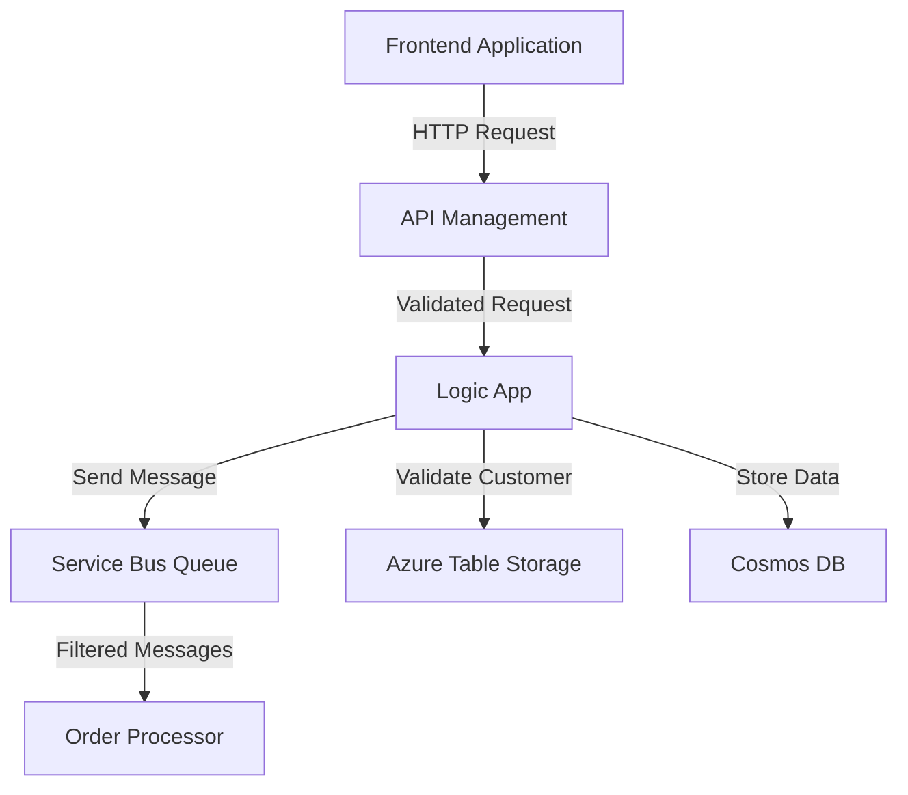

# Azure Integration Changes Documentation

## 1. Executive Summary

This update introduces key enhancements to Azure integrations, focusing on API Management (APIM) policies, Logic Apps, and Service Bus configurations. These changes aim to improve security, scalability, and operational efficiency by implementing rate-limiting, JWT validation, enhanced message processing, and structured data handling. The modifications align with organizational goals of robust API security, seamless data flow, and compliance with industry standards.

---

## 2. Technical Summary

### Key Changes
1. **API Management (APIM) Policies**:
   - Added rate-limiting to prevent abuse and ensure fair usage.
   - Configured Cross-Origin Resource Sharing (CORS) for frontend applications.
   - Implemented JWT validation for secure authentication.
   - Added fallback API key authentication.

2. **Logic Apps**:
   - Enhanced schema validation for incoming HTTP requests.
   - Added new parameters for secure connections (e.g., Service Bus connection string, Cosmos DB endpoint).
   - Integrated customer validation using Azure Table Storage.

3. **Service Bus**:
   - Configured a new queue (`order-processing-queue`) with advanced properties like duplicate detection, dead-lettering, and partitioning.
   - Added a subscription with SQL-based filtering for high-priority messages.
   - Enabled monitoring and diagnostic settings for operational insights.

---

## 3. Files Changed

| **File**                     | **Status** | **Type**         | **Description**                                                                 |
|------------------------------|------------|------------------|---------------------------------------------------------------------------------|
| `test/apim-policy.xml`       | Added      | API Management   | Introduced new APIM policies for rate-limiting, CORS, JWT validation, and API key fallback. |
| `test/sample.logicapp.json`  | Modified   | Azure Logic App  | Updated Logic App to include schema validation, secure parameters, and customer validation. |
| `test/servicebus-queue-config.json` | Added | Service Bus       | Added configuration for a new Service Bus queue with advanced properties and monitoring. |

---

## 4. Integration Impact

### Downstream Effects
- **APIM**: Enhanced security policies may reject requests that do not meet the new authentication requirements (e.g., missing JWT or API key).
- **Logic Apps**: New schema validation may cause failures for improperly formatted HTTP requests.
- **Service Bus**: SQL-based filtering ensures only relevant messages are processed, which could impact downstream consumers relying on unfiltered data.

### Dependencies
- **APIM**: Requires an active Azure AD tenant for JWT validation.
- **Logic Apps**: Depends on Azure Table Storage, Service Bus, and Cosmos DB connections.
- **Service Bus**: Requires diagnostic settings to be linked to a Log Analytics workspace.

---

## 5. Configuration Requirements

### APIM Policies
- **Rate Limiting**:
  - Calls: 100 per minute.
  - Counter Key: Client IP address.
- **CORS**:
  - Allowed Origins: `https://app.contoso.com`, `https://portal.contoso.com`.
  - Allowed Methods: GET, POST, PUT, DELETE.
  - Allowed Headers: All.
- **JWT Validation**:
  - OpenID Configuration URL: `https://login.microsoftonline.com/contoso.onmicrosoft.com/v2.0/.well-known/openid-configuration`.
  - Audience: `api://order-processing-api`.
  - Issuer: `https://sts.windows.net/{tenant-id}/`.

### Logic Apps
- **Parameters**:
  - `$connections`: Object containing connection details.
  - `serviceBusConnectionString`: Secure string for Service Bus.
  - `cosmosDbEndpoint`: Cosmos DB endpoint URL.
  - `storageAccountKey`: Secure string for Azure Storage account.

### Service Bus
- **Queue Properties**:
  - Name: `order-processing-queue`.
  - Lock Duration: 5 minutes.
  - Max Size: 5 GB.
  - Duplicate Detection: Enabled (10-minute window).
  - Dead-Lettering: Enabled.
  - Partitioning: Enabled.
- **Subscription**:
  - Name: `order-processor-subscription`.
  - SQL Filter: `priority = 'high' OR amount > 1000`.

---

## 6. Security Considerations

- **Authentication**:
  - Enforced JWT validation ensures only authorized users can access APIs.
  - API key fallback provides an additional layer of security.
- **Data Protection**:
  - Secure parameters (e.g., connection strings) are used in Logic Apps to prevent exposure.
- **Compliance**:
  - Diagnostic settings for Service Bus ensure compliance with monitoring and auditing requirements.

---

## 7. Cost Impact

| **Resource**         | **Cost Impact**                                                                 |
|-----------------------|---------------------------------------------------------------------------------|
| API Management        | Additional cost for rate-limiting and JWT validation processing.               |
| Logic Apps            | Increased cost due to additional actions (e.g., schema validation, API calls). |
| Service Bus           | Costs for queue storage, duplicate detection, and monitoring.                  |

---

## 8. Architecture Diagram

Below is a suggested Mermaid diagram to visualize the integration flow:

---

## 9. Testing Checklist

- **APIM**:
  - Verify rate-limiting blocks requests exceeding the limit.
  - Test CORS policy with allowed and disallowed origins.
  - Validate JWT authentication with valid and invalid tokens.
- **Logic Apps**:
  - Test HTTP request schema validation with valid and invalid payloads.
  - Verify customer validation logic using Azure Table Storage.
- **Service Bus**:
  - Ensure messages are routed correctly based on SQL filters.
  - Test dead-lettering for expired or undeliverable messages.
  - Validate diagnostic settings in Log Analytics.

---

## 10. Deployment Notes

- **Pre-deployment**:
  - Ensure all required Azure resources (e.g., Table Storage, Cosmos DB, Service Bus) are provisioned.
  - Update environment variables and secrets in Azure Key Vault.
- **Deployment**:
  - Deploy APIM policies using Azure portal or ARM templates.
  - Deploy Logic Apps using updated JSON definition.
  - Deploy Service Bus configuration using ARM or Terraform.
- **Post-deployment**:
  - Monitor API traffic and Service Bus metrics for anomalies.
  - Validate end-to-end integration flow.

---

This documentation provides a clear and structured overview of the changes, ensuring all stakeholders understand the technical and operational implications of the update.