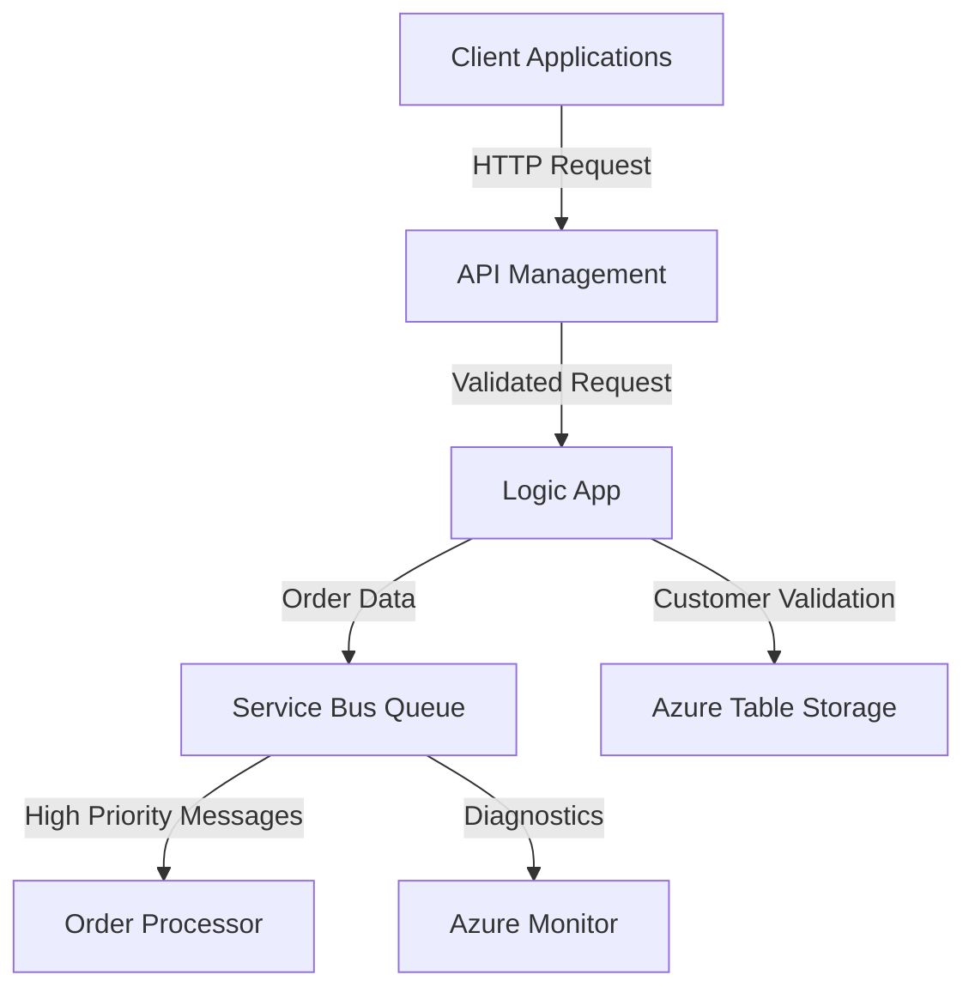

# Azure Integration Changes Documentation

## Executive Summary
This update introduces several enhancements to the Azure integration architecture, including new API Management (APIM) policies, updates to Logic Apps, and the addition of Service Bus queue configurations. These changes aim to improve security, scalability, and maintainability of the system while aligning with organizational compliance standards. Key highlights include:
- Implementation of rate limiting, CORS, and JWT validation in APIM policies.
- Enhanced Logic App workflows with new triggers, actions, and parameterized configurations.
- Introduction of a Service Bus queue for order processing with advanced configurations for reliability and monitoring.

---

## Technical Summary
### Key Changes
1. **API Management (APIM) Policies**:
   - Added rate limiting to prevent abuse.
   - Configured CORS policies to allow secure cross-origin requests.
   - Implemented JWT validation for authentication and role-based access control.
   - Fallback authentication using API keys.

2. **Logic Apps**:
   - Updated schema for HTTP trigger to include detailed order information.
   - Added new actions for customer validation using Azure Table Storage.
   - Parameterized configurations for Service Bus connection strings, Cosmos DB endpoints, and storage account keys.

3. **Service Bus Queue**:
   - Created a new queue `order-processing-queue` with advanced configurations:
     - Duplicate detection, dead lettering, and partitioning enabled.
     - Subscriptions with SQL filters for high-priority messages.
     - Diagnostic settings for monitoring and metrics retention.

---

## Files Changed
| **File**                          | **Status** | **Type**           | **Description**                                                                 |
|-----------------------------------|------------|--------------------|---------------------------------------------------------------------------------|
| `test/apim-policy.xml`            | Added      | API Management     | Introduces rate limiting, CORS, JWT validation, and API key fallback policies. |
| `test/sample.logicapp.json`       | Modified   | Azure Logic App    | Updates HTTP trigger schema and adds new actions for customer validation.      |
| `test/servicebus-queue-config.json` | Added      | Service Bus         | Defines a new queue with advanced configurations for order processing.         |

---

## Integration Impact
### Downstream Effects
1. **API Management**:
   - Enforces stricter authentication and rate limiting, which may impact clients not adhering to these policies.
   - CORS restrictions may require frontend applications to update their configurations.

2. **Logic Apps**:
   - New schema for HTTP trigger requires clients to send additional fields (`orderId`, `customerId`, `amount`, etc.).
   - Dependency on Azure Table Storage for customer validation.

3. **Service Bus**:
   - Downstream systems consuming messages from the queue must handle dead-lettered messages and adhere to new subscription filters.

### Dependencies
- Azure Table Storage for customer validation in Logic Apps.
- Azure Monitor for Service Bus diagnostics and metrics.
- Azure AD for JWT validation in APIM.

---

## Configuration Requirements
### Environment Variables
| **Variable**              | **Description**                         | **Type**       |
|---------------------------|-----------------------------------------|----------------|
| `serviceBusConnectionString` | Connection string for Service Bus.      | Secure String  |
| `cosmosDbEndpoint`        | Endpoint for Cosmos DB.                 | String         |
| `storageAccountKey`       | Access key for Azure Storage Account.   | Secure String  |

### APIM Policy Configuration
- Update the APIM instance with the new `apim-policy.xml` file.
- Ensure the OpenID Connect configuration URL is valid and accessible.

### Logic App Parameters
- Update Logic App parameters with the required connection strings and keys.

### Service Bus Configuration
- Deploy `servicebus-queue-config.json` to create the queue and subscriptions.

---

## Security Considerations
1. **Authentication and Authorization**:
   - JWT validation ensures only authorized users can access APIs.
   - Role-based access control (RBAC) enforced via required claims in JWT.

2. **Data Protection**:
   - Secure strings used for sensitive configurations (e.g., connection strings, keys).
   - Dead-lettering in Service Bus ensures failed messages are not lost.

3. **Compliance**:
   - Diagnostic settings in Service Bus align with organizational logging and monitoring policies.
   - CORS policies restrict access to trusted origins only.

---

## Cost Implications
1. **API Management**:
   - Increased cost due to additional policy evaluations (rate limiting, JWT validation).
   - Minimal impact unless high traffic volumes are encountered.

2. **Logic Apps**:
   - Additional actions and triggers may increase execution costs.
   - Parameterized configurations improve reusability, reducing duplication costs.

3. **Service Bus**:
   - Costs for message storage, duplicate detection, and dead-lettering.
   - Diagnostic settings and metrics retention may incur additional charges.

---

## Architecture Diagram
Below is a suggested architecture diagram in Mermaid syntax to visualize the integration flow:

---

## Testing Checklist
1. **API Management**:
   - Verify rate limiting by sending more than 100 requests per minute.
   - Test JWT validation with valid and invalid tokens.
   - Confirm CORS policies allow requests from trusted origins only.

2. **Logic Apps**:
   - Trigger the Logic App with valid and invalid payloads.
   - Validate customer lookup in Azure Table Storage.

3. **Service Bus**:
   - Send test messages to the queue and verify subscription filters.
   - Check dead-lettering for expired or failed messages.

---

## Deployment Notes
1. **Pre-Deployment**:
   - Ensure all required environment variables are configured.
   - Validate connectivity to dependent services (Azure Table Storage, Service Bus, etc.).

2. **Deployment**:
   - Deploy APIM policies using the Azure portal or ARM templates.
   - Update Logic Apps via the Azure portal or Bicep/Terraform templates.
   - Deploy Service Bus queue configuration using ARM templates or Terraform.

3. **Post-Deployment**:
   - Monitor logs and metrics for errors or performance issues.
   - Notify downstream consumers of schema and policy changes.

---

This documentation provides a comprehensive overview of the changes, ensuring both technical and management stakeholders are informed and prepared for the integration updates.