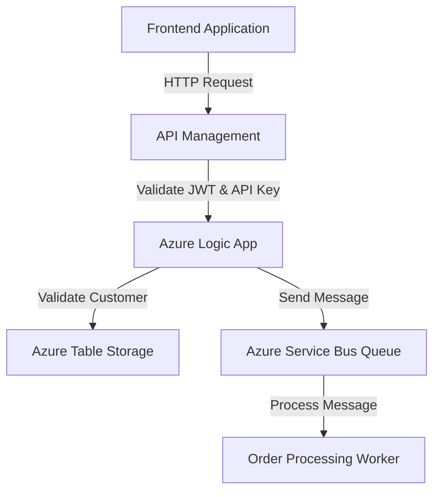

# Documentation for Pull Request #1: Add PR Auto-Updater Inspired by pr-auto for Seamless Doc Updates

---

## 1. Executive Summary

This pull request introduces significant updates to Azure integration components, including API Management (APIM) policies, Azure Logic Apps, and Service Bus configurations. These changes enhance security, scalability, and operational efficiency for the order-processing workflow. Key updates include:

- **APIM Policy Enhancements**: Added rate limiting, CORS, JWT validation, and API key fallback mechanisms.
- **Logic App Updates**: Improved schema validation, added parameterized connections, and integrated customer validation via Azure Table Storage.
- **Service Bus Configuration**: Introduced a new queue with advanced settings for message processing and monitoring.

These updates aim to improve system reliability, security, and maintainability while ensuring compliance with organizational policies.

---

## 2. Technical Summary

### **Key Changes**
1. **API Management (APIM) Policies**
   - Added rate limiting to prevent abuse.
   - Configured CORS policies to allow specific frontend origins.
   - Implemented JWT validation for secure authentication.
   - Introduced fallback authentication using API keys.

2. **Azure Logic Apps**
   - Enhanced trigger schema validation for incoming HTTP requests.
   - Parameterized connections for Service Bus, Cosmos DB, and Storage Account.
   - Integrated customer validation via Azure Table Storage.

3. **Azure Service Bus**
   - Created a new queue (`order-processing-queue`) with advanced configurations:
     - Duplicate detection
     - Dead-lettering
     - Partitioning for scalability
   - Added a subscription with SQL filters for high-priority messages.

---

## 3. Files Changed

| **File**                       | **Status** | **Type**         | **Description**                                                                 |
|--------------------------------|------------|------------------|---------------------------------------------------------------------------------|
| `test/apim-policy.xml`         | Added      | API Management   | Introduced new APIM policies for rate limiting, CORS, JWT validation, and API key fallback. |
| `test/sample.logicapp.json`    | Modified   | Azure Logic App  | Enhanced schema validation, parameterized connections, and added customer validation logic. |
| `test/servicebus-queue-config.json` | Added      | Service Bus       | Configured a new Service Bus queue with advanced settings and monitoring capabilities. |

---

## 4. Integration Impact

### **Downstream Effects**
- **APIM Policies**:
  - May impact frontend applications due to stricter CORS rules.
  - JWT validation requires all clients to use valid tokens.
- **Logic Apps**:
  - Requires updated connection strings and parameters in the deployment environment.
  - Changes in schema validation may reject improperly formatted requests.
- **Service Bus**:
  - New queue and subscription require consumers to update their configurations to use the new setup.

### **Dependencies**
- Azure Active Directory (AAD) for JWT validation.
- Azure Table Storage for customer validation in Logic Apps.
- Azure Monitor for Service Bus diagnostics and metrics.

---

## 5. Configuration Requirements

### **Environment Variables**
| **Parameter**                | **Type**       | **Description**                                   |
|-------------------------------|----------------|---------------------------------------------------|
| `serviceBusConnectionString` | Secure String  | Connection string for the Service Bus namespace. |
| `cosmosDbEndpoint`           | String         | Endpoint for Cosmos DB.                          |
| `storageAccountKey`          | Secure String  | Key for accessing the Azure Storage Account.     |

### **APIM Policy Configuration**
- Update the APIM instance with the new `apim-policy.xml` file.
- Ensure the OpenID Connect configuration URL is accessible.

### **Service Bus Configuration**
- Deploy the `servicebus-queue-config.json` file to create the queue and subscription.

---

## 6. Security Considerations

### **Authentication and Authorization**
- JWT validation ensures only authenticated users with valid roles can access APIs.
- API key fallback provides an additional layer of security for legacy systems.

### **Data Protection**
- Secure strings are used for sensitive parameters (e.g., connection strings, keys).
- Dead-lettering in Service Bus ensures failed messages are retained for analysis.

### **Compliance**
- CORS policies restrict access to trusted origins, ensuring compliance with data access policies.
- Diagnostic settings in Service Bus align with organizational monitoring and logging standards.

---

## 7. Cost Impact

### **Resource Consumption**
- **API Management**: Minimal cost increase due to additional policy processing.
- **Logic Apps**: Increased cost for additional actions and parameterized connections.
- **Service Bus**: Costs associated with the new queue and subscription, including message retention and monitoring.

### **Estimated Monthly Costs**
| **Resource**       | **Estimated Cost** |
|---------------------|--------------------|
| API Management      | $10 - $20         |
| Logic Apps          | $50 - $100        |
| Service Bus Queue   | $20 - $40         |

---

## 8. Architecture Diagram

Below is a suggested architecture diagram using Mermaid syntax to visualize the integration flow:

---

## 9. Testing Checklist

### **APIM Policies**
- [ ] Verify rate limiting works as expected.
- [ ] Test CORS policies with allowed and disallowed origins.
- [ ] Validate JWT authentication with valid and invalid tokens.
- [ ] Test API key fallback mechanism.

### **Logic Apps**
- [ ] Trigger the Logic App with valid and invalid schemas.
- [ ] Verify parameterized connections resolve correctly.
- [ ] Confirm customer validation logic works as expected.

### **Service Bus**
- [ ] Ensure the queue is created with the correct properties.
- [ ] Test message delivery and dead-lettering.
- [ ] Validate SQL filters for high-priority messages.

---

## 10. Deployment Notes

### **Pre-Deployment**
1. Update environment variables with the required connection strings and keys.
2. Ensure all dependent resources (e.g., AAD, Table Storage) are configured.

### **Deployment Steps**
1. Deploy the APIM policies using the Azure portal or ARM templates.
2. Update the Logic App definition with the modified JSON file.
3. Deploy the Service Bus configuration using the Azure CLI or ARM templates.

### **Post-Deployment**
- Monitor API Management and Service Bus metrics for anomalies.
- Validate end-to-end functionality of the order-processing workflow.

---

This documentation provides a comprehensive overview of the changes, their impact, and the steps required for a successful deployment. If you have any questions, please contact the author of the pull request.