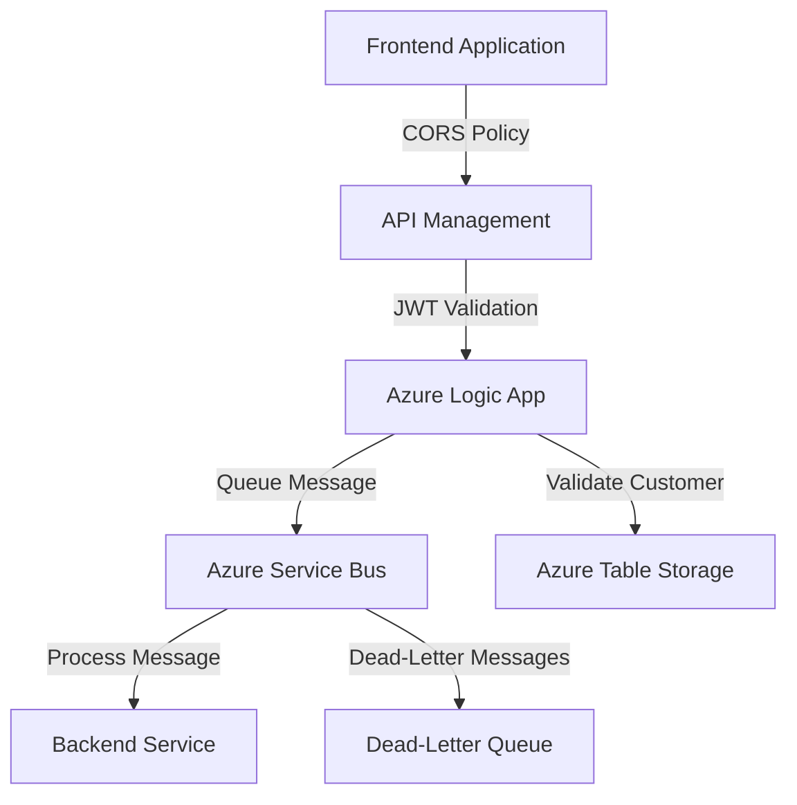

# Azure Integration Changes Documentation

## Executive Summary

This update introduces critical enhancements to Azure integrations, including new API Management (APIM) policies, modifications to Azure Logic Apps, and configurations for Azure Service Bus. These changes aim to improve security, scalability, and operational efficiency. Key updates include:

- **Enhanced Security**: Implementation of JWT validation and API key fallback in APIM.
- **Improved Scalability**: Service Bus configurations for high-throughput message processing.
- **Streamlined Operations**: Logic App schema updates for better data validation and integration.

These changes are expected to enhance the reliability and security of the system while maintaining compliance with organizational and regulatory standards.

---

## Technical Summary

### Key Changes
1. **API Management (APIM) Policy Updates**:
   - Added rate limiting to prevent abuse.
   - Configured CORS policies for frontend applications.
   - Implemented JWT validation for secure authentication.
   - Added fallback API key authentication.

2. **Azure Logic App Updates**:
   - Updated trigger schema to validate incoming data.
   - Added new actions for customer validation using Azure Tables.
   - Introduced secure parameters for sensitive data (e.g., connection strings).

3. **Azure Service Bus Configuration**:
   - Created a new queue (`order-processing-queue`) with advanced settings for message processing.
   - Configured dead-lettering, duplicate detection, and partitioning for reliability.
   - Added monitoring and diagnostic settings for operational insights.

---

## Files Changed

| **File**                        | **Status** | **Type**          | **Description**                                                                 |
|----------------------------------|------------|-------------------|---------------------------------------------------------------------------------|
| `test/apim-policy.xml`           | Added      | API Management    | Introduced rate limiting, CORS, JWT validation, and API key fallback policies. |
| `test/sample.logicapp.json`      | Modified   | Azure Logic App   | Updated schema, added secure parameters, and enhanced actions for validation.  |
| `test/servicebus-queue-config.json` | Added      | Azure Service Bus | Configured a new queue with advanced settings for message processing.          |

---

## Integration Impact

### Downstream Effects
- **Frontend Applications**: Must adhere to updated CORS policies.
- **Consumers of APIM**: Need to include valid JWT tokens or API keys in requests.
- **Service Bus Consumers**: Must handle new queue configurations, including dead-lettering and duplicate detection.

### Dependencies
- **Azure Active Directory**: Required for JWT validation.
- **Azure Tables**: Used for customer validation in Logic Apps.
- **Monitoring Workspace**: Service Bus monitoring depends on a configured Log Analytics workspace.

---

## Configuration Requirements

### Environment Variables
- `serviceBusConnectionString`: Secure string for Service Bus connection.
- `cosmosDbEndpoint`: Endpoint for Cosmos DB.
- `storageAccountKey`: Secure string for accessing Azure Storage.

### APIM Configuration
- Update policies in the APIM instance with the provided `apim-policy.xml`.

### Logic App Parameters
- Ensure the following parameters are configured in the Logic App:
  - `$connections`: Connection object for API connections.
  - `serviceBusConnectionString`: Secure string for Service Bus.
  - `cosmosDbEndpoint`: Cosmos DB endpoint.
  - `storageAccountKey`: Secure string for Azure Storage.

### Service Bus Configuration
- Deploy the `servicebus-queue-config.json` file to configure the queue and subscriptions.

---

## Security Considerations

### Authentication and Authorization
- **JWT Validation**: Ensures only authenticated users with valid roles can access APIs.
- **API Key Fallback**: Provides an additional layer of security for legacy systems.

### Data Protection
- **Secure Parameters**: Sensitive data (e.g., connection strings) is stored securely using Azure Key Vault or secure parameters.
- **Dead-Lettering**: Prevents message loss by routing unprocessable messages to a dead-letter queue.

### Compliance Impacts
- **GDPR**: Ensures data protection by validating and securing sensitive information.
- **HIPAA**: Enhances security for systems handling healthcare data.

---

## Cost Impact

| **Resource**           | **Cost Implication**                                                                 |
|-------------------------|--------------------------------------------------------------------------------------|
| API Management          | Additional cost for rate limiting and JWT validation processing.                    |
| Azure Logic Apps        | Increased cost due to additional actions and triggers.                              |
| Azure Service Bus       | Costs associated with the new queue, including storage, monitoring, and throughput. |

---

## Architecture Diagram

Below is a suggested architecture diagram in Mermaid syntax to visualize the integration flow:

---

## Testing Checklist

- [ ] Verify APIM policies:
  - [ ] Test rate limiting with 100 requests per minute.
  - [ ] Validate JWT authentication with valid and invalid tokens.
  - [ ] Test API key fallback authentication.
- [ ] Validate Logic App:
  - [ ] Ensure trigger schema rejects invalid payloads.
  - [ ] Confirm customer validation action retrieves correct data.
- [ ] Test Service Bus:
  - [ ] Send messages to the queue and verify processing.
  - [ ] Confirm dead-lettering for unprocessable messages.
  - [ ] Validate duplicate detection and partitioning.
- [ ] Monitor logs and metrics for all components.

---

## Deployment Notes

1. **Pre-Deployment**:
   - Ensure all required environment variables are configured.
   - Validate the APIM instance and Logic App connections.

2. **Deployment**:
   - Deploy APIM policies using the `apim-policy.xml` file.
   - Update the Logic App with the modified `sample.logicapp.json`.
   - Configure the Service Bus queue using `servicebus-queue-config.json`.

3. **Post-Deployment**:
   - Verify all integrations are functioning as expected.
   - Monitor logs and metrics for anomalies.
   - Notify stakeholders of the successful deployment.

---

This documentation provides a comprehensive overview of the changes, their impacts, and the necessary steps for successful integration. For further assistance, please contact the Azure solutions team.